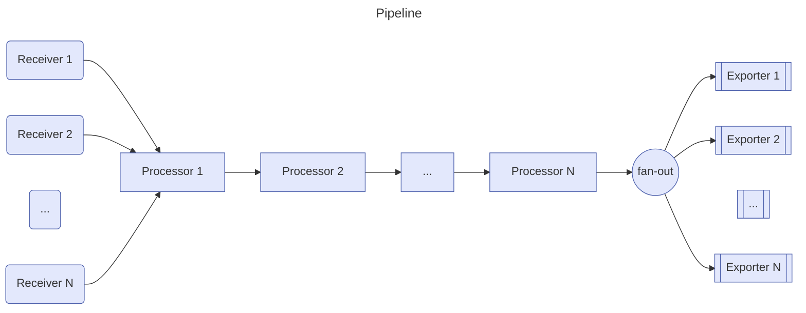

# 概述

> 参考：
>
> - [GitHub 项目，opentelemetry-collector](https://github.com/open-telemetry/opentelemetry-collector)
> - [官方文档，Collector](https://opentelemetry.io/docs/collector/)

OpenTelemetry Collector 提供了一种与供应商无关的 receive(接收)、process(处理) 和 export(导出) 遥测数据的实现。它消除了运行、操作和维护多个代理/收集器的需要。这具有改进的可扩展性，并支持开源可观测性数据格式（例如 Jaeger、Prometheus、Fluent Bit、etc. ）发送到一个或多个开源或商业后端。

> Collector 会根据配置定时采集数据或被动接收数据以缓存，然后可以主动推送或被动等待拉取。Prometheus 可以配置 static_configs 从 OTel Collector 抓取其缓存的最新数据。

# 架构

> 参考：
>
> - [官方文档，Collector - 架构](https://opentelemetry.io/docs/collector/architecture/)

OTel Collector 是一种 [DataPipeline](/docs/6.可观测性/DataPipeline/DataPipeline.md) 的实现程序，通常分为如下几个 Pipeline component(管道组件)

- **Receivers(接收器)** # Receivers 从一个或多个来源收集遥测数据。ta 们可以是基于 pull 或 push 的，并且可以支持一个或多个[数据源](https://opentelemetry.io/docs/concepts/signals/)。
- **Processors(处理器)** # 处理 Receivers 收到的数据
- **Exporters(导出器)** # Exproters 将数据发送到一个或多个后端或目的地。Exproters 可以是基于 pull 或 push 的，并且可以支持一个或多个[数据源](https://opentelemetry.io/docs/concepts/signals/)。
- **Extensions(扩展)** # 可扩展 Collector 的功能以完成与处理遥测数据不直接相关的任务。e.g. 可以添加用于收集器运行状况监控、服务发现或数据转发等的扩展。详细的扩展配置请参见 [extension README](https://github.com/open-telemetry/opentelemetry-collector/blob/main/extension/README.md)



# 部署 Collector

> 参考：
>
> - [官方文档，Collector - 部署](https://opentelemetry.io/docs/collector/deployment/)
> - [OpenTelemetry Collector 部署方式的选择](https://flashcat.cloud/blog/opentelemetry-collector-deploy/)

# Collector 关联文件与配置

# 基本配置示例

下面的配置文件，配置了名为 otlp 的 Receiver；配置了名为 batch 的 Processor；配置了名为 otlp 的 Exporter；配置了 3 个扩展，分别为 health_check、pprof、zpages。在 service 字段配置加载哪些扩展、处理 traces 类型的数据时，使用 otlp 接收器，batch 处理器，otlp 导出器；其他 metrics 与 logs 同理。

```yaml
receivers:
  otlp:
    protocols:
      grpc:
        endpoint: 0.0.0.0:4317
      http:
        endpoint: 0.0.0.0:4318
processors:
  batch:

exporters:
  otlp:
    endpoint: otelcol:4317

extensions:
  health_check:
  pprof:
  zpages:

service:
  extensions: [health_check, pprof, zpages]
  pipelines:
    traces:
      receivers: [otlp]
      processors: [batch]
      exporters: [otlp]
    metrics:
      receivers: [otlp]
      processors: [batch]
      exporters: [otlp]
    logs:
      receivers: [otlp]
      processors: [batch]
      exporters: [otlp]
```
