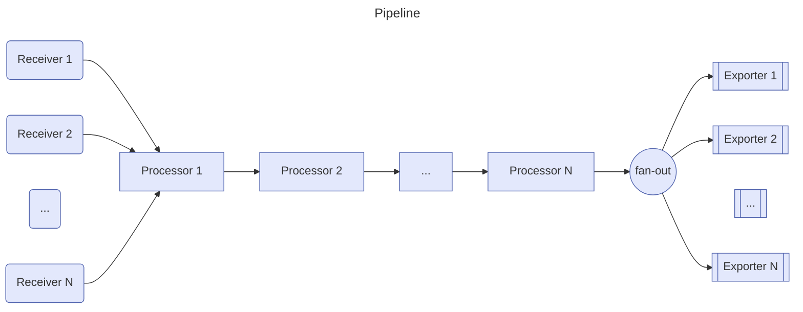

# 概述

> 参考：
>
> - [GitHub 项目，open-telemetry/opentelemetry-collector](https://github.com/open-telemetry/opentelemetry-collector)
> - [官方文档，Collector](https://opentelemetry.io/docs/collector/)

OpenTelemetry Collector 提供了一种与供应商无关的 receive(接收)、process(处理) 和 export(导出) 遥测数据的实现。它消除了运行、操作和维护多个代理/收集器的需要。这具有改进的可扩展性，并支持开源可观测性数据格式（例如 Jaeger、Prometheus、Fluent Bit、etc. ）发送到一个或多个开源或商业后端。

> Collector 会根据配置定时采集数据或被动接收数据以缓存，然后可以主动推送或被动等待拉取。Prometheus 可以配置 static_configs 从 OTel Collector 抓取其缓存的最新数据。


# 架构

> 参考：
>
> - [官方文档，Collector - 架构](https://opentelemetry.io/docs/collector/architecture/)

OTel Collector 是一种 [DataPipeline](/docs/6.可观测性/DataPipeline/DataPipeline.md) 的实现程序，通常分为如下几种 **Pipeline component(管道组件)**

- **Receiver(接收器)** # Receivers 从一个或多个来源收集遥测数据。ta 们可以是基于 pull 或 push 的，并且可以支持一个或多个[数据源](https://opentelemetry.io/docs/concepts/signals/)。
- **Processor(处理器)** # 处理 Receivers 收到的数据
- **Exporter(导出器)** # Exproters 将数据发送到一个或多个后端或目的地。Exproters 可以是基于 pull 或 push 的，并且可以支持一个或多个[数据源](https://opentelemetry.io/docs/concepts/signals/)。



除了管道组件外，还有两个组件

- **Extension(扩展)** # 可扩展 Collector 的功能以完成与处理遥测数据不直接相关的任务。e.g. 可以添加用于收集器运行状况监控、服务发现或数据转发等的扩展。详细的扩展配置请参见 [extension README](https://github.com/open-telemetry/opentelemetry-collector/blob/main/extension/README.md)
- **Connector(连接器)** # 连接器连接两个管道，既充当 Exporter，又充当 Receiver。连接器在一个管道的末端作为 Exporter 消费数据，并在另一个管道的起点作为 Receiver 发出数据。消费和发出的数据可以是相同类型，也可以是不同类型的数据。可以使用 Connector 来汇总、复制或路由消费的数据。

---

## Type and Kind

OpenTelemetry Collector 一共有两个项目

- [open-telemetry/opentelemetry-collector](https://github.com/open-telemetry/opentelemetry-collector) # Collector 核心、框架、内置组件。e.g. Receiver 的 otel, etc.；exporter 的 otel, otelhttp, etc.
- [open-telemetry/opentelemetry-collector-contrib](https://github.com/open-telemetry/opentelemetry-collector-contrib) # 第三方组件。e.g. Receiver 的 filelog, etc.

这两个项目的代码目录通常都包含 receiver, processor, exporter 这几个，用来存放各种**管道组件**的代码。管道组件的具体实现代码的目录名称，以 “管道组件类型+管道组件种类” 的形式命名。如下图，红框是 “管道组件 **<font color="#ff0000">Type(类型)</font>**” 黄框是 “管道组件 **<font color="#f2bd2c">Kind(种类)</font>**”。对于 contrib 项目，也是同样的，e.g. contrib 项目中的 receiver/filelogreceiver/ 目录实现的是 Receiver 种类 的 filelog 类型管道，用来从本地文件系统的日志文件接收数据。


通过这种查看方式，可以帮助我们在[配置](/docs/6.可观测性/OpenTelemetry/Collector/Configuration.md) OTel Collector 知道应该如何定义组件的 ID。

> [!Tip] Kind 与 Type
>
> Receiver, Processor, Exporter, Extension, Connector 属于 Kind(种类)
>
> otlp, batch, otlphttp, etc. 属于 Type(类型)。有内置的 Type（在 open-telemetry/opentelemetry-collector 项目中），也有第三方的 Type（在 open-telemetry/opentelemetry-collector-contrib 项目中）
>
> 一个 Kind 下包含多个 Type

https://github.com/open-telemetry/opentelemetry-collector/blob/component/v1.32.0/component/component.go#L81

```go
// Kind represents component kinds.
type Kind struct {
	name string
}

var (
	KindReceiver  = Kind{name: "Receiver"}
	KindProcessor = Kind{name: "Processor"}
	KindExporter  = Kind{name: "Exporter"}
	KindExtension = Kind{name: "Extension"}
	KindConnector = Kind{name: "Connector"}
)
```

https://github.com/open-telemetry/opentelemetry-collector/blob/component/v1.32.0/component/identifiable.go#L32

```go
// Type is the component type as it is used in the config.
type Type struct {
	name string
}

// String returns the string representation of the type.
func (t Type) String() string {
	return t.name
}
```

# 部署 Collector

> 参考：
>
> - [官方文档，Collector - 安装](https://opentelemetry.io/docs/collector/installation/)
> - [官方文档，Collector - 部署](https://opentelemetry.io/docs/collector/deployment/)(多种部署架构)
> - [OpenTelemetry Collector 部署方式的选择](https://flashcat.cloud/blog/opentelemetry-collector-deploy/)

多种部署 Collector 模式：

- **SDK** # 最简单的模式是完全不使用收集器。此模式由使用 OpenTelemetry SDK [检测的](https://opentelemetry.io/docs/languages/)应用程序组成，这些应用程序将遥测信号（跟踪、指标、日志）直接导出到后端
- **Agent** # 一个独立的 Collector 二进制文件（使用 OpenTelemetry SDK 实现）采集数据并发送到后端
- **Gateway** # 接收多个具有 OpenTelemetry SDK 的程序的数据并发送到后端

最简单的是 Agent 模式，使用一个 otelcol(或 otelcol-contrib) 程序收集数据并发送到后端

每种部署模式都可以通过 Docker、二进制、etc. 方式部署

## 二进制

https://github.com/open-telemetry/opentelemetry-collector-releases/tree/main/distributions 有各种 [Systemd](docs/1.操作系统/Systemd/Systemd.md) 所需的 service 文件

# Collector 关联文件与配置

# 基本配置示例

下面的配置文件，配置了名为 otlp 的 Receiver；配置了名为 batch 的 Processor；配置了名为 otlp 的 Exporter；配置了 3 个扩展，分别为 health_check、pprof、zpages。在 service 字段配置加载哪些扩展、处理 traces 类型的数据时，使用 otlp 接收器，batch 处理器，otlp 导出器；其他 metrics 与 logs 同理。

```yaml
receivers:
  otlp:
    protocols:
      grpc:
        endpoint: 0.0.0.0:4317
      http:
        endpoint: 0.0.0.0:4318

processors:
  batch:

exporters:
  otlp:
    endpoint: otelcol:4317

extensions:
  health_check:
  pprof:
  zpages:

service:
  extensions: [health_check, pprof, zpages]
  pipelines:
    traces:
      receivers: [otlp]
      processors: [batch]
      exporters: [otlp]
    metrics:
      receivers: [otlp]
      processors: [batch]
      exporters: [otlp]
    logs:
      receivers: [otlp]
      processors: [batch]
      exporters: [otlp]
```
