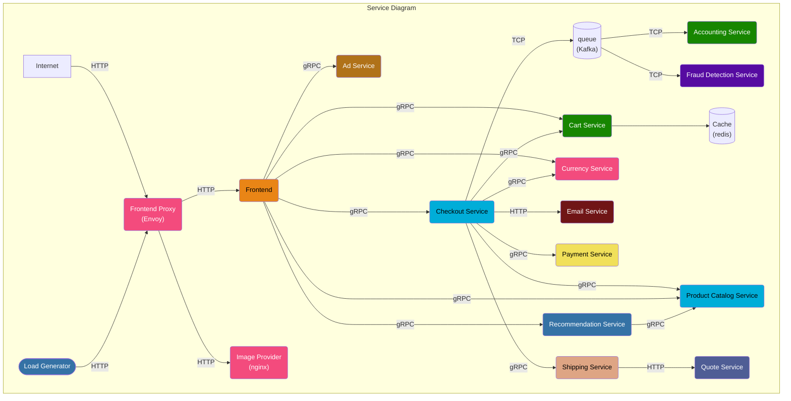
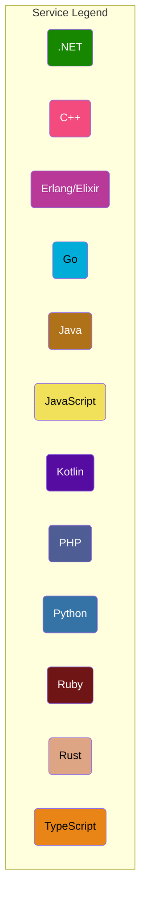
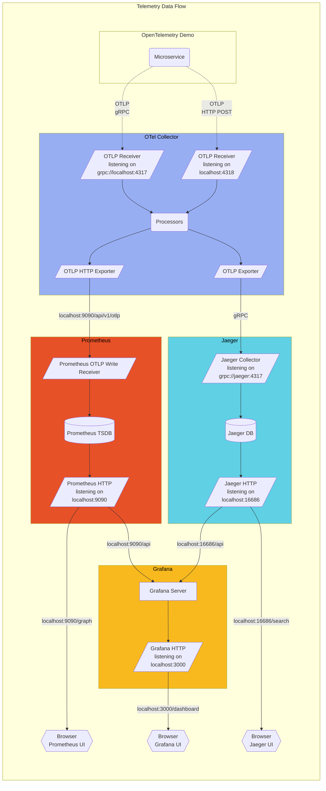

# 概述

> 参考：
>
> - [GitHub 组织，OpenTelemetry](https://github.com/open-telemetry)
> - [官网](https://opentelemetry.io/)
> - [官方文档](https://opentelemetry.io/docs/)
> - [公众号-OpenTelemetry，OpenTelemetry 核心原理篇 ：怎么理解分布式链路追踪技术？](https://mp.weixin.qq.com/s/bcziZg8RhCrMGYgFeN76cw)
> - [公众号-OpenTelemetry，在生产环境如何选择靠谱的 APM 系统](https://mp.weixin.qq.com/s/3dD0hIuqpXdepLVC6V7aoA)

**OpenTelemetry(开放式遥测技术，简称 OTel)** 是一组 **API、SDK、工具、更是一种遥测标准**，旨在创建和管理 **Telemetry Data(遥测数据)**。通过 OpenTelemetry 标准创建的程序，可以采集 OpenTelemetry 标准的遥测数据，并发送到我们指定的后端中。OpenTelemetry 支持各种流行的开源后端项目，比如 Prometheus、Jaeger 等。

遥测数据包括

- **Logs(日志数据)** # [日志系统](/docs/6.可观测性/Logs/日志系统.md)
- **Metrics(指标数据)** # [监控系统](/docs/6.可观测性/Metrics/监控系统概述/监控系统概述.md)
- **Traces(链路追踪数据)** # [追踪系统](/docs/6.可观测性/Traces/追踪系统.md)
- **Baggage** # TODO: 这是啥

Notes：OpenTelemetry 不是像 Prometheus、Jaeger 那样的可观测性后端。相反，OpenTelemetry 支持将数据导出到各种开源和商业的后端产品中，它提供了一个可插拔的架构，因此可以轻松添加其他技术协议和格式。

OTel 之于可观测性系统，类似 OCI 之于容器。但是能比 OCI 提供更多。

## OpenTelemetry 组件

目前，OpenTelemetry 由以下几个主要组件组成：

- **规范** # 与编程语言无关的规范，规定了遥测数据格式等
- **工具** # 用于 采集/接收、转换、导出 遥测数据的工具。比如官方提供的 [OTel Collector](/docs/6.可观测性/OpenTelemetry/Collector.md)
- **SDK** # 用于为各种编程语言提供编写符合 OpenTelemetry 规范的工具
- **自动 instrumentation 和 贡献包** # TODO: 没搞懂这是什么？

## Signals

https://opentelemetry.io/docs/concepts/signals/

OpenTelemetry 创建了一个名词，将 *可观测数据（遥测数据）* 抽象为 Signals。

OpenTelemetry 是围绕 Signals 或 遥测类别 构建的。Metrics、Logs、Traces、Baggage 都是一种 Signals。每个 Signals 代表一组连贯的、独立的功能。每个信号都遵循单独的生命周期，定义其当前的稳定性级别。

OpenTelemetry 的目的是收集、处理和导出 **Signals**。传统定义中，[Signal(信号)](docs/1.操作系统/Kernel/Process/Inter%20Process%20Communication/Signal(信号).md) 是系统输出，描述操作系统和应用程序的底层活动。在 OpenTelemetry 中，Signals 可以是您想要在特定时间点测量的内容，例如温度或内存使用情况，也可以是您想要跟踪的分布式系统组件的事件。您可以将不同的 Signals 组合在一起，从不同角度观察同一项技术的内部运作情况。

# OpenTelemetry 实现

[GitHub 项目，grafana/agent](https://github.com/grafana/agent) #

[GitHub 项目，flashcatcloud/categraf](https://github.com/flashcatcloud/categraf) # 通过配置文件，采集所有数据，然后 Push 给 Prom(Prom 需要使用 `--web.enable-remote-write-receiver` 为自身开启远程写功能)，暂时没有等待 pull 的功能(截止 2022.6.1 v0.1.0 版本)

https://www.guance.com/ 观测云。。。。这个产品。。怎么说呢。。上来就让人各种注册才能体验的感觉很不好。。而且在云原生社区可观测性 SIG 群里，这家人的表达方式和处理事情的态度给人的感觉也不好~工作内部矛盾放在群里说。。还揭露个人隐私。。。。o(╯□╰)o

[GitHub 项目，open-telemetry/opentelemetry-go-instrumentation](https://github.com/open-telemetry/opentelemetry-go-instrumentation) # 使用 Go 语言利用 eBPF 实现的 OpenTelemetry 自动 Instrumentation

## Grafana Agent

> 参考：
>
> - [GitHub 项目，grafana/agent](https://github.com/grafana/agent)
> - [官方文档](https://grafana.com/docs/agent/latest/)

Grafana Agent 收集遥测数据并将其转发到 Grafana Stack、Grafana Cloud 或 Grafana Enterprise 的开源部署，然后可以在其中分析您的数据。您可以在 Kubernetes 和 Docker 上安装 Grafana Agent，或者作为 Linux、macOS 和 Windows 机器的系统进程。

Grafana Agent 是开源的，其源代码可在 GitHub 上的<https://github.com/grafana/agent>上获得。

Grafana Agent 适用于希望收集和转发遥测数据以进行分析和待命警报的工程师、操作员或管理员。那些运行 Grafana Agent 的人必须安装和配置 Grafana Agent 才能正确收集遥测数据并监控正在运行的代理的健康状况。

# 最佳实践

[公众号-云原生小白，Opentelemetry 实践分享 - Golang篇](https://mp.weixin.qq.com/s/wiAT4GHaeitn2o6Byr_kGA)

# OpenTelemetry Demo

> 参考：
>
> - [GitHub 项目，open-telemetry/opentelemetry-demo](https://github.com/open-telemetry/opentelemetry-demo)
> - [官方文档，Demo](https://opentelemetry.io/docs/demo/)
> - https://flashcat.cloud/blog/opentelemetry-demo-step-by-step/

**OpenTelemetry Demo** 是一个由用不同编程语言编写的微服务组成的 Demo 系统，这些微服务通过 gRPC 和 HTTP 相互通信；以及一个使用 [Locust](https: locust.io/) 来伪造用户流量的负载生成器。

这是一个基于微服务的分布式系统，旨在说明 OpenTelemetry 在近乎真实的环境中的实现，这个 demo 中提供了许多的服务，而且包含了几乎所有主流的语言，可以很好的模拟我们实际的使用场景。

- 提供可用于演示 OpenTelemetry 仪器和可观测性的分布式系统的实际示例。
- 为供应商、工具作者和其他人构建一个基础，以扩展和演示他们的 OpenTelemetry 集成。
- 为 OpenTelemetry 贡献者创建一个活生生的示例，用于测试新版本的 API、SDK 以及其他组件或增强功能。

架构图来源: https://opentelemetry.io/docs/demo/architecture/

Demo 中的 Collector 的配置在 [otelcol-config.yml](https://github.com/open-telemetry/opentelemetry-demo/blob/main/src/otelcollector/otelcol-config.yml) 这里找到

Find the **Protocol Buffer Definitions** in the `/pb/` directory.

# OpenTelemetry 历史

OTel 于 2019 年 5 月，由 [OpenTracing](https://opentracing.io/) 与 OpenCensus 合并而成([Google Open Source](https://opensource.googleblog.com/2019/05/opentelemetry-merger-of-opencensus-and.html))，

# OpenTelemetry Protocol

> 参考：
>
> - [GitHub 项目，open-telemetry/opentelemetry-proto](https://github.com/open-telemetry/opentelemetry-proto)

**OpenTelemetry Protocol(简称 OTLP)**
